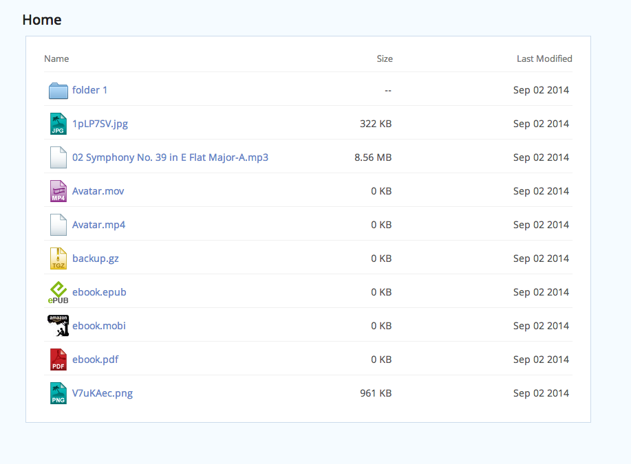

# BeautifulIndex [v1.0]
***

`BeautifulIndex` is a response to the less than beautiful styling of the apache directory listing. 

**Note**: Long filenames fail to display, and there is no support for other character sets.

### Screenshot

### Installation

Option 1:
Drop the index.php file and dlf folder anywhere you want, and set the .htaccess to point to that location for index listing.

Option 2:
Drop the index.php file and dlf folder in the directory to be styled, and be sure index.php is the first file checked for styling.

### FAQ

> How do I add/change icons?

Save the icon into the dlf folder, and modify the array in the index.php:147 line to add the mapping.

#### License

`BeautifulIndex` is licensed with GPL

#### Contributors

Ivan Smirnov  
based on work by Ash Young <ash@evoluted.net>, www.evoluted.net
